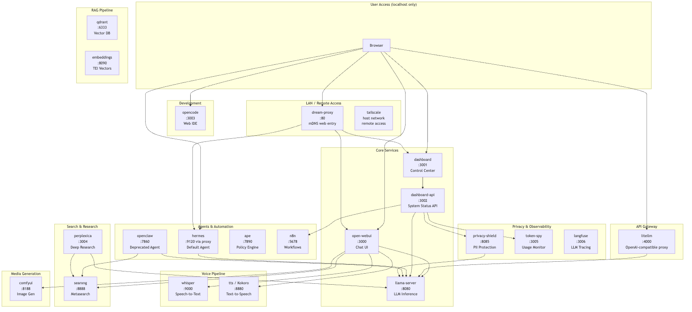
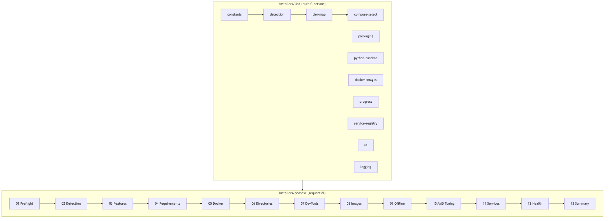
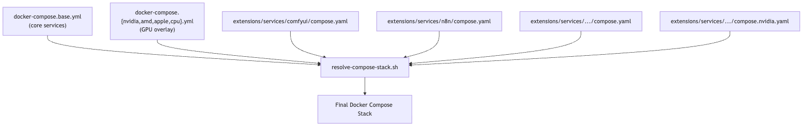

# Dream Server Architecture

> Version 2.5.3 | Fully local AI stack deployed on user hardware with a single command

## Overview

Dream Server is a self-hosted AI platform built around 24 bundled service
manifests, Docker Compose services, and a small number of host-managed helpers
across NVIDIA, AMD, Apple Silicon, Intel Arc, and CPU/cloud fallback paths. The
system is structured in two layers: an **outer wrapper** (installer scripts, CI,
resources) and the **core product** (`dream-server/`) containing all deployable
code.

The architecture follows a **layered compose model**: a base compose file defines core services, GPU-specific overlays configure hardware acceleration, and extension compose files add optional services. A registry-driven CLI (`dream-cli`) manages the lifecycle.

## System Architecture

## Functional Areas

### 1. Inference Layer

The LLM inference engine (`llama-server`) is the foundation. GPU overlays select the correct container image and runtime:

| Backend | Image | Acceleration |
|---------|-------|-------------|
| NVIDIA | `llama.cpp:server-cuda-b9014` default, overrideable via `LLAMA_SERVER_IMAGE` | CUDA, all GPUs reserved |
| AMD | Custom `dream-lemonade-server` | ROCm / Vulkan / NPU via Lemonade |
| Apple | Native host `llama-server` via macOS installer; Docker overlay is CPU fallback | Metal on host; containers reach `host.docker.internal:8080` |
| Intel Arc | SYCL backend | Experimental |
| CPU | `llama.cpp:server-b8248` | Pure CPU fallback |

**LiteLLM** (port 4000) sits in front as an OpenAI-compatible proxy, enabling cloud fallback in hybrid mode and standardized API access for all consumers.

### 2. Chat & UI Layer

- **open-webui** (port 3000) — Primary chat interface with integrated image generation (ComfyUI/SDXL), voice I/O (Whisper + Kokoro), and web search (SearXNG)
- **dashboard** (port 3001) — React/Vite control center for feature discovery, service health, setup wizard, model management
- **dashboard-api** (port 3002) — FastAPI backend with routers for setup, features, agents, privacy, workflows, and updates

### 3. Search & Research

- **searxng** (port 8888) — Privacy-respecting metasearch engine
- **perplexica** (port 3004) — Deep research combining search results with LLM reasoning

### 4. Agents & Automation

- **hermes** (internal 9119, auth proxy on 9120) — default agent, fronted by `hermes-proxy` and magic-link auth
- **openclaw** (port 7860) — deprecated optional agent framework retained for compatibility
- **ape** (port 7890) — Agent Policy Engine enforcing allow/deny rules on tool access
- **n8n** (port 5678) — Visual workflow automation with a pre-built catalog

### 5. RAG Pipeline

- **qdrant** (port 6333) — Vector database for document retrieval
- **embeddings** (port 8090) — HuggingFace TEI for generating vector embeddings

### 6. Voice Pipeline

- **whisper** (port 9000) — Speech-to-text (OpenAI-compatible API)
- **tts/Kokoro** (port 8880) — Text-to-speech (OpenAI-compatible API)

### 7. Media Generation

- **comfyui** (port 8188) — Image generation with SDXL Lightning (4-step)

### 8. Privacy & Observability

- **privacy-shield** (port 8085) — PII detection and scrubbing middleware
- **token-spy** (port 3005) — Token usage and cost tracking
- **langfuse** (port 3006) — LLM observability and tracing

### 9. Development

- **opencode** (port 3003) — Web IDE (runs as host systemd service, not Docker)

## Installer Architecture

The installer is a 13-phase pipeline orchestrated by `install-core.sh`.
Installer libraries in `installers/lib/` are pure functions (no side effects);
`lib/service-registry.sh` loads service manifests and port metadata; phases in
`installers/phases/` execute sequentially.

| Phase | Purpose |
|-------|---------|
| 01 Preflight | Root/OS/tools checks, existing install detection |
| 02 Detection | GPU hardware detection, tier assignment, compose config selection |
| 03 Features | Interactive feature selection (voice, workflows, RAG, images, etc.) |
| 04 Requirements | RAM, disk, GPU, port availability checks |
| 05 Docker | Install Docker, Compose, NVIDIA Container Toolkit |
| 06 Directories | Create dirs, copy source, generate `.env`, configure services |
| 07 DevTools | Install Claude Code, Codex CLI, OpenCode |
| 08 Images | Build image pull list, download all Docker images |
| 09 Offline | Configure air-gapped operation |
| 10 AMD Tuning | AMD APU sysctl, modprobe, GRUB, tuned setup |
| 11 Services | Download GGUF model, generate `models.ini`, launch stack |
| 12 Health | Verify services responding, configure Perplexica, pre-download STT models |
| 13 Summary | Generate URLs, desktop shortcuts, summary JSON |

Generated config is written in more than one place. When changing `.env`,
OpenCode, Perplexica, Hermes, or LiteLLM/Lemonade behavior, review
`docs/INSTALLER-ARCHITECTURE.md#generated-config-writers` before merging.

## Docker Compose Layering

The stack uses compose file merging. The resolver script dynamically discovers enabled extensions and composes the full stack:

## Key Execution Flows

### 1. Installation Flow

`install.sh` → `install-core.sh` → sources `installers/lib/*.sh` → sources `installers/phases/01..13.sh` sequentially. Each phase reads state set by prior phases via exported variables. Hardware detection (phase 02) drives all downstream decisions: tier assignment selects the model GGUF, context window, batch size, and compose overlays.

### 2. Service Startup Flow

`dream-cli start` → `resolve-compose-stack.sh` reads enabled services from `.env` → assembles `docker compose -f base -f gpu-overlay -f ext1 -f ext2 ...` → `docker compose up -d`. Health checks gate dependent services (e.g., `open-webui` waits for `llama-server` healthy).

### 3. Chat Request Flow

Browser → `open-webui:3000` → `llama-server:8080/v1/chat/completions` → GPU inference → response streamed back. If hybrid mode: `open-webui` → `litellm:4000` → tries `llama-server` first, falls back to cloud API.

### 4. Agent Execution Flow

Browser → `hermes-proxy:9120` → magic-link auth gate → `dream-hermes:9119`
inside the Docker network → Hermes tools/search/reasoning → local LLM via an
OpenAI-compatible endpoint. OpenClaw still exists as a deprecated optional
agent on `:7860`; APE provides policy/audit controls for agent tool surfaces.

### 5. Dashboard Feature Discovery Flow

Browser → `dashboard:3001` → `dashboard-api:3002/api/features` → API reads all service manifests, checks container health via Docker socket, cross-references GPU capabilities and VRAM → returns feature list with status (`enabled`, `available`, `insufficient_vram`, `services_needed`) and recommendations.

## Configuration

### Environment Variables (Key Connections)

| Variable | Default | Controls |
|----------|---------|----------|
| `GPU_BACKEND` | detected | `nvidia`, `amd`, `apple`, `cpu` |
| `GGUF_FILE` | tier-dependent | Model file in `/data/models/` |
| `CTX_SIZE` | `16384` | Context window (tokens) |
| `DREAM_MODE` | `local` | `local`, `cloud`, `hybrid` |
| `LITELLM_KEY` | generated | API gateway authentication |
| `DASHBOARD_API_KEY` | generated | Dashboard API authentication |

### Port Map

All services bind to `127.0.0.1` (localhost only). Canonical port assignments live in `config/ports.json`.

| Port | Service | Port | Service |
|------|---------|------|---------|
| 80 | dream-proxy | 3000 | open-webui |
| 3001 | dashboard | 3002 | dashboard-api |
| 3003 | opencode | 3004 | perplexica |
| 3005 | token-spy | 3006 | langfuse |
| 4000 | litellm | 5678 | n8n |
| 6333 | qdrant | 6334 | qdrant gRPC |
| 7860 | openclaw | 7890 | ape |
| 8080 | llama-server | 8085 | privacy-shield |
| 8090 | embeddings | 8188 | comfyui |
| 8585 | brave-search | 8880 | tts |
| 8888 | searxng | 9000 | whisper |
| 9120 | hermes-proxy | host network | tailscale |

## Extension System

Every bundled service manifest lives under `extensions/services/<id>/` with:

- `manifest.yaml` — Service contract (id, port, health endpoint, category, GPU backends, dependencies, features)
- `compose.yaml` — Docker Compose service definition (optional; core services live in `docker-compose.base.yml`)
- `compose.{nvidia,amd}.yaml` — GPU-specific overlays
- `Dockerfile` — Custom image build (if needed)

The manifest schema is enforced by `extensions/schema/service-manifest.v1.json`. The service registry library (`lib/service-registry.sh`) provides lookup functions for the CLI and installer.

## CI/CD

| Workflow | Purpose |
|----------|---------|
| `test-linux.yml` | Integration suite: smoke, manifests, health, BATS, tier map, contracts |
| `matrix-smoke.yml` | Multi-distro smoke (Ubuntu, Debian, Fedora, Arch, openSUSE) |
| `validate-compose.yml` | Docker Compose file validation |
| `validate-env.yml` | Environment variable schema validation |
| `dashboard.yml` | Dashboard build and lint |
| `lint-shell.yml` | ShellCheck on all `.sh` files |
| `lint-python.yml` | Python linting (ruff, black) |
| `type-check-python.yml` | Python type checking (mypy) |
| `secret-scan.yml` | GitLeaks secret detection |
| `lint-powershell.yml` | PowerShell linting for Windows installer |

## Design Principles

Priority when principles conflict: **Let It Crash > KISS > Pure Functions > SOLID**

- **Let It Crash**: No broad catches, no silent swallowing. Errors propagate visibly. Bash uses `set -euo pipefail` everywhere.
- **KISS**: Readable over clever. One function, one job. No premature abstraction.
- **Pure Functions**: Installer libraries (`installers/lib/`) are the pure functional core; phases are the imperative shell.
- **SOLID**: Extend via config/data (manifests, backend JSON), not code modification.
